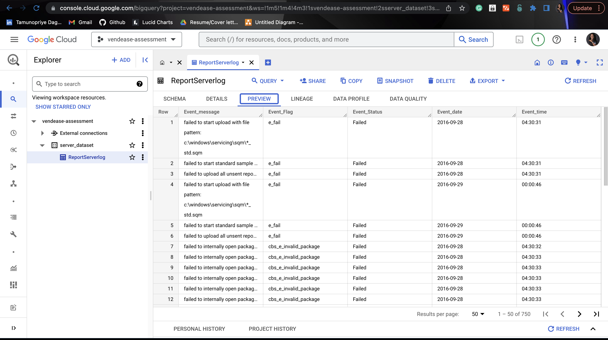

# Server Report Data Pipeline

### Technologies used
- <b>Apache Airflow</b>: Apache Airflow is an open-source platform for authoring, scheduling and monitoring data and computing workflows. For this project it was used to manage data extraction and transformation process  
- <b>Google Bigquery</b>: This is a cloud-based data warehousing platform for data storage and analytics purpose. For this project it was used to store transformed data for analysis  
- <b>Google Cloud Function</b>: This is Google's serverless compute solution for creating event-driven applications. For this project, it is to be used to trigger DAG by running based on a schedule.  
- <b>Pandas</b> : This is a flexible and easy to use open source data analysis and manipulation tool, built on top of the Python programming language. For this project it was used to transform data scraped  
- <b>Google Cloud Storage</b>: This is a highly scalable object storage service that stores data as objects within buckets. It is commonly used to store and distribute large media files, data backups and static website files. For this project it is used to store data scraped from target website.   
- <b>Streamlit</b>:Streamlit is an open-source Python library that makes it easy to create and share beautiful, custom web apps for machine learning and data science. For this project it was used to display data analysed from bigquery   

### Extracting  Datasets
Data was scraped from <a href="https://github.com/logpai/loghub/blob/master/Windows/Windows_2k.log">this URL </a> using Python's request module.

#### Data Ingestion Architecture

#### WORK FLOW FOR DATA INGESTION (Does not include logic to handle fresh data)
1. Airflow was used due to its  extensive monitoring tool and its error handling methods. 
    - To achieve data ingestion, three tasks were created using python to extract the data, transform the data, and load into bigquery for analysis.
    - Tasks on airflow run per shedule defined in 'default_args'
    - It was set up locally in a docker container and executed through docker compose commands. Dags can be viewed <a href="https://github.com/priye-1/Server_report_data_pipeline/tree/master/dags">here </a>  Hosting Airflow on Google Compose or Compute engine is advised for a production environment.
    - Upon task competion or Failure Airflow sends mail to stakeholder
  
Email from airflow:    

2. Bigquery was set up on the Google Cloud Platform for data entry. A project and dataset was created using the GCP console while a table was created and data was inserted using Bigquery Python's API. A helper class was also created for reproducibility and to handle all Bigquery operations. Find data class <a href="https://github.com/priye-1/Server_report_data_pipeline/blob/master/dags/helpers/bigquery_helper.py">here 
Data exported from Bigquery can be found <a href="https://docs.google.com/spreadsheets/d/1H4FiiJb9ydCecGrk77mJxmU0Z5znKA45QOGmgJXxpYI/edit#gid=2097998581">here 
 

3. Streamlit was locally set up independently to display Data analyzed from bigquery. Code to show how many times each event_flag occured can be found <a href="https://github.com/priye-1/Server_report_data_pipeline/blob/master/query_analysis.py">here</a>  
 
 

#### Proposed Architecture to Handle only Fresh Data

 

### PROPOSED WORK FLOW 
- Google cloud function is used as a serverless service that runs per schedule.
- For the first run, after pulling data from API, a bucket is created and the data is stored in GCS using timestamp as the filename. Timestamp is gotten from the API response parameters
- Google Cloud Function then triggers airflow DAG to run 
- Airflow extracts latest data from GCS, transforms data, and loads into Bigquery.
- For subsequest runs, google cloud function is triggered
- The function picks the last file saved in GCS and extracts the timestamp from name, saved as 'latest_timestamp'
- It then passes 'latest_timestamp' as a parameter to the API call, hence the API call is restricted to extract data with timestamp higher than 'latest_timestamp'
- if timestamp parameter is not available for API get request, Data can be extracted first and then filtered  based on rows with timestamp higher than 'latest_timestamp'
 

